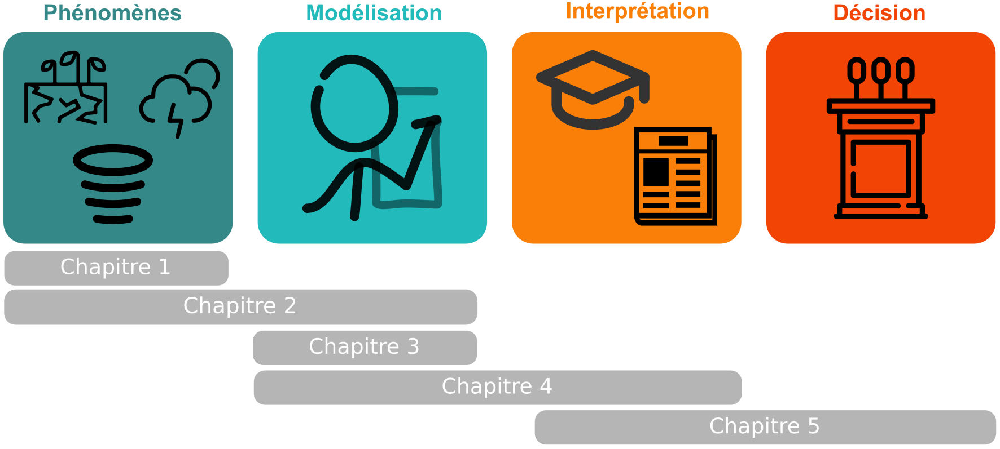
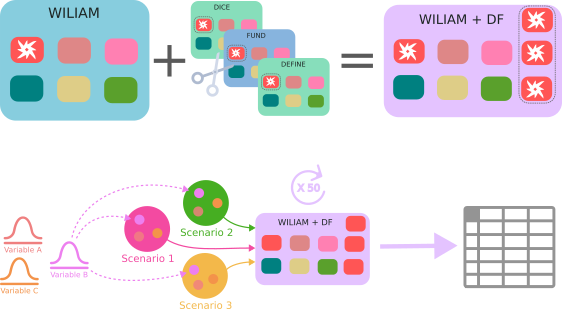

# Fonctions de dommage dans les modèles intégrés

Ce repo contient le code source latex de mon mémoire de M2, réalisé au sein de Centre de Mathématiques Appliquées (Mines Paris - PSL).Il permet de recréer le document pdf en éxecutant le code latex.

La dernière version compilée est disponible sur la droite, dans l'onglet "releases", ou encore en cliquant ici : [Télécharger le PDF](https://github.com/ggenelot/Memoire/releases/latest/download/report.pdf).

Un site readthedocs permet d'avoir accès au code source qui a permis de produire les figures et à des ressources aditionnelles. 

Voici une approche schématique du contenu du mémoire, ainsi que les résumés de chaque chapitre. 

*Figure — Schéma illustrant le processus présenté dans l'introduction.*

La modélisation consiste à représenter de manière simplifiée des phénomènes.
Dans notre cas, il s’agit de phénomènes liés au changement climatique. Il existent avant toute forme de représentation (A), puis font
l’objet d’une simplification (B). Ils sont ensuite interprétés (C), avant de conduire à des actions, telles que des décisions politiques (D).
Chacune de ces étapes correspond à un chapitre : d’abord, on commence par évoquer les différents phénomènes qui sont modélisés
(1), puis on cherche à savoir comment ceux-ci sont représentés (2). On analyse ensuite l’importance du choix de représentation sur
les interprétations possibles (3), avant de discuter des enjeux éthiques liés à l’interprétation des résultats des modèles (4). Enfin, on
s’intéresse à la manière dont cette chaîne de production de connaissance alimente le débat public (5).

## Quel rôle pour les fonctions de dommage dans les modèles intégrés ? 

Nous explorons les enjeux éthiques liés à la modélisation des impacts du changement climatique. Dans
un premier temps, nous recensons des fonctions de dommages issues de différents modèles, pour en
comparer les caractéristiques et identifier des enjeux éthiques. Nous implémentons ensuite les fonctions
de dommage de DICE, FUND et WITNESS au sein du modèle WILIAM, et proposons un coefficient
qui représente l’équité spatiale. Nous abordons l’épistémologie des modèles intégrés au regard de
ce nouveau coefficient, avant de de réaliser des entretiens semi-directifs avec des acteurs du régime
climatique (chercheurs, décideurs). Nous montrons que les fonctions de dommage sont très sensibles aux
implications éthiques sous-jacentes, et qu’il faut qu’elles soit explicitées et modifiables par les utilisateurs.

### Impacts, risques et mesures

Le changement climatique est à la fois extremement incertain, et nécessite des actions et des
prises de décisions rapides et de grande envergure. Ce paradoxe a donné naissance à des institutions,
comme le CCNUCC ou le GIEC, et à des outils, comme la modélisation intégrée. A chaque fois, l’objectif
est de réduire l’incertitude et de favoriser le rapprochement entre l’action politique et la connaissance
scientifique. Dans cette introduction, nous introduisons quelques uns des concepts cadres qui nous serons
utiles tout au long du mémoire.

### La relative diversité de la représentation des dommages

Cette partie s’intéresse à la représentation des dommages climatiques dans les modèles intégrés.
Nous commençons par recenser le plus de fonctions de dommages, issues de différents modèles. Nous
explorons ensuite les choix qui se posent aux modélisateurs, en explicitant les avantages et inconvénients
de chacun. Nous observons que la majeure partie de ces dommages est représenté en terme de PIB, ce qui
pourrait exclure d’autres mécanismes préjudiciables.

### Rendre visible : quantifier les choix éthiques

Ce chapitre propose une approche économétrique des effets de la modélisation des fonctions de
dommage. On utilise le modèle de simulation WILIAM auquel on ajoute des fonctions de dommage issues
de DICE, WITNESS et DEFINE. On ajoute un nouveau paramètre, appelé pondérateur géographique,
qui permet de tenir compte des différences de revenu entre les régions. 50 runs sont éxecutés en faisant
varier ce pondérateur de manière aléatoire. On interpréte les données obtenues à l’aide d’un modèle
économétrique, qui permet d’évaluer l’impact relatif des variables physiques, méthodologiques et éthiques
sur le niveau comptabilisé de dommages. on trouve que ce coefficient a un impact important, dont la
magnitude peut être comparée à celle des autres variations. 

<!-- HTML/GitHub fallback -->

    

*Figure — On ajoute des fonctions de dommage issues d'autre modèle à WILIAM. On fait tourner ce nouveau modèle de nombreuses fois en faisant varier différents paramètres, et on interprète les variables de sortie du modèle.*

### Ethique de la modélisation des dommages

Nous avons identifié dans le chapitre 3 que les choix éthiques implicites ou explicites réalisés par
les modélisateurs ont un impact sur le niveau de dommage dont l’amplitude est comparable à celle d’autres
facteurs. Dans ce chapitre, nous explorons les enjeux éthiques que ce constat pose. Nous présentons les
notions d’éthique procédurale, intrinsèque et extrinsèque. Nous montrons ensuite à travers les écrits de
Longino, que la modélisation est fortement porteuse de valeurs. Nous nous interrogeons finalement sur
la responsabilité qu’on les modélisateurs des effets de leurs résultats sur les politiques publiques. Nous
avançons qu’il est essentiel que les hypothèses normatives soient plus clairement énoncées et qu’elles
peuvent remettrent en cause la pertinence des modèles. Cependant, ces hypothèses ne semblent pas
représenter de doute normativement innaproprié.

### Interpréter le modèle dans le monde réel

Cette partie du mémoire s’intéresse à la manière dont les résultats issus de la modélisation
intégrée sont interprétés dans le débat public et permettent de prendre des décisions. Plus précisement,
on s’interroge sur les utilisations des modèles par divers acteurs de la politique climatique : techniciens,
décideurs, journalistes, scientifiques, activistes. Pour cela, on réalise une série d’entretiens semis-directifs.
Ils ont pour but de répondre aux questions suivantes : comment est interprétée l’incertitutde inhérente
aux modèles pour la prise de décision ?

## Licence

Ce mémoire est diffusé sous licence **Creative Commons Attribution – NonCommercial – NoDerivatives 4.0 International (CC BY-NC-ND 4.0)**.

Vous êtes libre de le partager, sous réserve de :

- **créditer l’auteur**,
- **ne pas l’utiliser à des fins commerciales**,
- **ne pas le modifier** ni en produire des œuvres dérivées.

Texte complet de la licence :  
https://creativecommons.org/licenses/by-nc-nd/4.0/